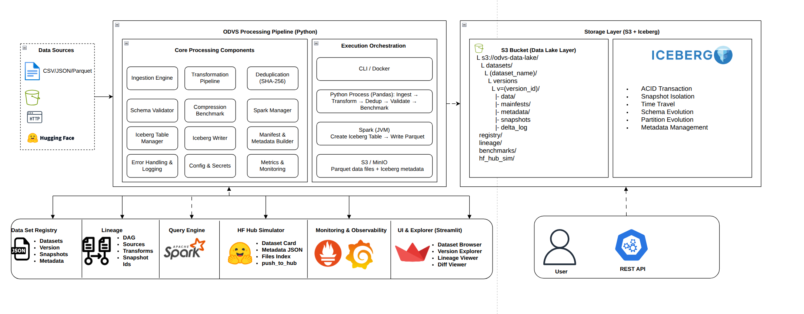

<div align="center">

```
 ██████╗ ██████╗ ██╗   ██╗███████╗
██╔═══██╗██╔══██╗██║   ██║██╔════╝
██║   ██║██║  ██║██║   ██║███████╗
██║   ██║██║  ██║╚██╗ ██╔╝╚════██║
╚██████╔╝██████╔╝ ╚████╔╝ ███████║
 ╚═════╝ ╚═════╝   ╚═══╝  ╚══════╝
```

# Open Dataset Versioning System

**Production-grade dataset versioning on Apache Iceberg, Apache Spark, and S3-compatible storage.**

[](https://python.org)
[](https://spark.apache.org)
[](https://iceberg.apache.org)
[](https://streamlit.io)
[](https://min.io)
[](LICENSE)

</div>

---

## What Is ODVS?

ODVS (Open Dataset Versioning System) is a **open-source platform** for managing dataset lifecycle at scale — ingestion, versioning, deduplication, schema validation, lineage tracking, and time-travel queries — backed by **Apache Iceberg** as the table format, **Apache Spark** as the compute engine, and **S3-compatible object storage** as the warehouse backend.

It is designed to operate at the engineering standard of platforms like Hugging Face Hub, Netflix's Metacat, and Airbnb's Dataportal — while remaining fully self-hostable, deployable via Docker, and configurable via environment variables.

### What Problem Does It Solve?

Without ODVS, teams typically manage datasets through ad-hoc file naming conventions (`dataset_v2_final_FINAL.csv`), lose provenance across pipeline runs, and have no reliable way to reproduce a model training run against the exact dataset version it used. ODVS replaces that with:

- **Immutable, versioned Iceberg snapshots** for every write
- **Time-travel reads** to any past version of any dataset
- **Schema evolution** without breaking downstream consumers
- **Hash-based deduplication** across incremental ingestion batches
- **Full lineage tracking** from source URI → transforms → Iceberg snapshot
- **HF Hub-style dataset cards** generated automatically per version
- **A Streamlit explorer UI** for dataset discovery and diff visualization

---

## Architecture



### Technology Choices

| Layer | Technology | Reason |
|---|---|---|
| Table format | Apache Iceberg | ACID, time-travel, schema evolution, partition evolution, hidden partitioning |
| Compute | Apache Spark | Iceberg-native write path; `writeTo().append()` generates Parquet internally |
| Object store | MinIO / AWS S3 | S3A connector; any S3-compatible backend works without code changes |
| Parquet compression | zstd (default) | Best ratio/speed tradeoff for cold storage; snappy available for hot paths |
| DataFrame bridge | PyArrow | Zero-copy pandas → Spark conversion; same wire format as Parquet |
| Registry | JSON flat file | Local dev default; pluggable — can back with PostgreSQL or REST catalog |
| Lineage | JSON DAG | Self-contained; pluggable with DataHub / OpenLineage in production |
| UI | Streamlit | Rapid, Python-native; no frontend build step |
| Infrastructure | Terraform + Docker Compose | IaC-first; same config drives local and cloud |

---

## Quick Start

### Prerequisites

---

### Option A — Docker (Recommended, Zero-Config)

The fastest path. Spins up MinIO, Spark, ODVS pipeline, and Streamlit in one command.

```bash
# 1. Clone
git clone https://github.com/odvs/odvs.git
cd odvs

# 2. Edit credentials if needed (defaults work for local dev)

# 3. Start the full stack
docker compose -f docker/docker-compose.yml up -d

# 4. Wait for services to be healthy (~30s)
docker compose -f docker/docker-compose.yml ps

# 5. Run the demo pipeline (ingests cafe_sales.csv → Iceberg → Registry)
docker compose -f docker/docker-compose.yml run --rm odvs-pipeline \
  python src/odvs/scripts/run_pipeline.py \
  --source examples/cafe_sales.csv \
  --dataset-name "Cafe Sales" \
  --version-tag v1.0.0 \
  --compression zstd

# 6. Open the Streamlit UI
open http://localhost:8501

# 7. Explore storage in MinIO Console
open http://localhost:9001   # user: minioadmin / pass: minioadmin
```

**Services started:**

| Service | URL | Credentials |
|---|---|---|
| MinIO S3 API | http://localhost:9000 | minioadmin / minioadmin |
| MinIO Console | http://localhost:9001 | minioadmin / minioadmin |
| Spark Master UI | http://localhost:8080 | — |
| ODVS Streamlit UI | http://localhost:8501 | — |
| Prometheus | http://localhost:9090 | — |
| Grafana | http://localhost:3000 | admin / odvs_grafana |

---

### Option B — Local Development (No Docker)

Full local setup for development. You still need MinIO running for S3 storage.

```bash
# 1. Clone
git clone https://github.com/odvs/odvs.git
cd odvs

# 2. Create virtual environment
python -m venv .venv
source .venv/bin/activate      # Windows: .venv\Scripts\activate

# 3. Install dependencies
pip install -r requirements.txt

# 4. Start MinIO only (S3 backend — required)
docker compose -f docker/docker-compose.yml up -d minio minio-init

# 5. Set environment variables
export S3_ENDPOINT_URL=http://localhost:9000
export AWS_ACCESS_KEY_ID=minioadmin
export AWS_SECRET_ACCESS_KEY=minioadmin
export ODVS_S3_BUCKET=odvs-warehouse
export ODVS_ENV=development

# Or use a .env file:
source .env   # or use `python-dotenv`

# 6. Run your first pipeline
python scripts/run_pipeline.py \
  --source examples/cafe_sales.csv \
  --dataset-name ecommerce_events \
  --version-tag v1.0.0 \
  --description "E-commerce events" \
  --tags ecommerce,events,sales \
  --compression zstd

# 7. Launch the UI
streamlit run streamlit_app/app.py
# → Opens http://localhost:8501
```

---

## Running the Pipeline

### `run_pipeline.py` — Full Reference

The main entry point. Orchestrates all 12 pipeline steps in sequence.

```bash
python scripts/run_pipeline.py \
  --source          <path|uri>   # Required: local file, s3://..., http://, or hf_hub://
  --dataset-name    <name>       # Required: logical dataset name (e.g. ecommerce_events)
  --version-tag     <tag>        # Required: version identifier (e.g. v1.0.0, 2024-06-01)
  --description     <text>       # Optional: human-readable description
  --tags            <a,b,c>      # Optional: comma-separated tags
  --compression     <codec>      # Optional: zstd|snappy|gzip|none (default: zstd)
  --source-type     <type>       # Optional: csv|parquet|json|jsonl|hf_hub|s3|http
  --schema-config   <file.json>  # Optional: JSON schema validation rules
  --partition-columns <a,b>      # Optional: Iceberg partition keys
  --sort-columns    <a,b>        # Optional: Iceberg sort order columns
  --incremental                  # Optional: append-only (skip table recreation check)
  --skip-benchmark               # Optional: skip compression benchmark step
  --dry-run                      # Optional: ingest + transform only, no Iceberg write
```

**Examples:**

```bash
# Basic CSV ingest
python src/odvs/scripts/run_pipeline.py \
  --source examples/cafe_sales.csv \
  --dataset-name product_catalog \
  --version-tag v1.0.0

# S3 source with partitioning
python src/odvs/scripts/run_pipeline.py \
  --source s3://my-bucket/events/2024-06/*.parquet \
  --dataset-name user_events \
  --version-tag 2024-06 \
  --partition-columns event_date \
  --sort-columns user_id \
  --compression zstd

# Hugging Face Hub dataset
python src/odvs/scripts/run_pipeline.py \
  --source hf_hub://stanfordnlp/imdb \
  --dataset-name imdb_reviews \
  --version-tag v1.0.0 \
  --tags nlp,sentiment,text

# With schema validation (hard gate)
python src/odvs/scripts/run_pipeline.py \
  --source examples/cafe_sales.csv \
  --dataset-name orders \
  --version-tag v2.0.0 \
  --schema-config examples/schema_config.json

# Dry run (no Spark, no S3 write — fast validation)
python src/odvs/scripts/run_pipeline.py \
  --source examples/cafe_sales.csv \
  --dataset-name orders \
  --version-tag v1.0.0 \
  --dry-run
```

**Schema config file format (`examples/schema_config.json`):**

```json
{
  "allow_extra_columns": true,
  "min_rows": 1,
  "columns": [
    { "name": "user_id",    "dtype": "object",  "nullable": false, "required": true },
    { "name": "event_type", "dtype": "object",  "nullable": false,
      "allowed_values": ["click", "view", "purchase"] },
    { "name": "amount",     "dtype": "float64", "nullable": true,
      "min_value": 0, "max_value": 1000000 },
    { "name": "email",      "dtype": "object",  "nullable": true,
      "regex_pattern": "^[^@]+@[^@]+\\.[^@]+$", "max_null_fraction": 0.3 }
  ]
}
```

### Pipeline Step Breakdown

When you run `run_pipeline.py`, here is exactly what happens:

```
Step 1   s3_bootstrap       Ensure S3 bucket exists (idempotent)
Step 2   ingestion          Read source → pandas DataFrame + IngestionManifest
Step 3   transform          Apply TransformPipeline.standard() (7 transforms)
Step 4   deduplication      SHA-256 hash per row, remove duplicates
Step 5   validation         Evaluate SchemaSpec rules (aborts on ERROR)
Step 6   compression_bench  Benchmark zstd/snappy/gzip/none (advisory only)
Step 7   spark_init         Build or reuse SparkSession with Iceberg + S3A config
Step 8   table_bootstrap    CREATE TABLE IF NOT EXISTS with partition/sort specs
Step 9   iceberg_write      writeTo(table).append() → Iceberg-managed Parquet
Step 10  registry_update    Upsert dataset + version record to local registry
Step 11  lineage_record     Write DAG node (sources, transforms, snapshot_id)
Step 12  hf_simulation      Generate Hub metadata, simulate push_to_hub()
```

---

## Managing Tables

### `create_table.py`

```bash
# Create a table from a schema file
python ssrc/odvs/scripts/create_table.py \
  --table-name user_events \
  --schema-file examples/schema_config.json \
  --partition-by event_date \
  --sort-by user_id \
  --comment "User interaction events"

# Inline column definitions
python src/odvs/scripts/create_table.py \
  --table-name products \
  --columns product_id:string name:string price:double category:string \
  --partition-by category

# Add a column (schema evolution — no data rewrite)
python src/odvs/scripts/create_table.py \
  --table-name user_events \
  --add-column session_duration_ms long

# Inspect table metadata and snapshot history
python src/odvs/scripts/create_table.py --table-name user_events --info

# List all tables
python src/odvs/scripts/create_table.py --table-name any --list

# Drop table (metadata only)
python src/odvs/scripts/create_table.py --table-name user_events --drop

# Drop table + purge data files from S3
python src/odvs/scripts/create_table.py --table-name user_events --drop --purge --yes
```

---

## Dataset Registry

### `register_dataset.py`

```bash
# List all datasets
python src/odvs/scripts/register_dataset.py  list

# Detailed dataset info
python src/odvs/scripts/register_dataset.py  info --dataset ecommerce_events

# Version history
python src/odvs/scripts/register_dataset.py  versions --dataset ecommerce_events

# Full lineage graph + provenance
python src/odvs/scripts/register_dataset.py  lineage --dataset ecommerce_events
python src/odvs/scripts/register_dataset.py  lineage --dataset ecommerce_events --json

# Generate HF Hub-style dataset card
python src/odvs/scripts/register_dataset.py  card --dataset ecommerce_events
python src/odvs/scripts/register_dataset.py  card --dataset ecommerce_events \
  --output docs/ecommerce_events_card.md \
  --license apache-2.0

# Search by name or tag
python src/odvs/scripts/register_dataset.py  search --query events
python src/odvs/scripts/register_dataset.py  search --tag ecommerce

# Registry stats
python src/odvs/scripts/register_dataset.py  stats

# Export full registry as JSON
python src/odvs/scripts/register_dataset.py  export --output registry_backup.json

# Manually register an external dataset
python src/odvs/scripts/register_dataset.py  register \
  --dataset external_prices \
  --description "Daily commodity prices from Bloomberg" \
  --tags finance,prices,daily \
  --source-uri s3://external-feeds/prices/latest.parquet
```

---

## Benchmarking

### `benchmark_pipeline.py`

```bash
# Compression benchmark only (no Spark — fast, uses PyArrow)
python src/odvs/scripts/benchmark_pipeline.py \
  --source examples/cafe_sales.csv \
  --dataset-name ecommerce_events \
  --codecs snappy gzip zstd none \
  --sample-n 50000

# Full pipeline benchmark (includes Spark + Iceberg write + read timing)
python src/odvs/scripts/benchmark_pipeline.py \
  --source examples/cafe_sales.csv \
  --dataset-name ecommerce_events \
  --full-pipeline \
  --compression zstd

# Output results as JSON (for CI regression tracking)
python src/odvs/scripts/benchmark_pipeline.py \
  --source examples/cafe_sales.csv \
  --dataset-name ecommerce_events \
  --output benchmark_results.json
```

**Example compression benchmark output:**

```
══════════════════════════════════════════════════════════════════════
  Compression Report: ecommerce_events
  Rows: 10,000 | Columns: 14
══════════════════════════════════════════════════════════════════════
Codec      | Ratio  |    Size | Write   | Read    | MB/s
──────────────────────────────────────────────────────────────────────
zstd       | 4.21x  | 182.3KB | 23.1ms  | 11.4ms  | 89.2 MB/s
gzip       | 3.98x  | 193.1KB | 41.7ms  | 12.0ms  | 56.1 MB/s
snappy     | 2.87x  | 268.4KB | 8.3ms   | 8.9ms   | 124.3 MB/s
none       | 1.00x  | 769.2KB | 5.1ms   | 6.2ms   | 168.7 MB/s
──────────────────────────────────────────────────────────────────────
  Recommended codec: zstd
══════════════════════════════════════════════════════════════════════
```

---

## Streamlit UI

Start the dataset explorer:

```bash
# Local dev
streamlit run src/odvs/streamlit_app/app.py

# Docker
docker compose -f docker/docker-compose.yml up -d odvs-ui
open http://localhost:8501
```

**UI pages:**

| Page | Description |
|---|---|
| **Catalog** | Searchable dataset registry with tag filtering, inline schema preview, row count metrics |
| **Dataset Detail** | Per-dataset deep dive: Schema tab, Version History (bar chart), Lineage DAG, Dataset Card (HF format), Diff Viewer |
| **Run Pipeline** | Upload a CSV, run transform + dedup + compression benchmark in-browser, preview results, get CLI command |
| **Compression Benchmark** | Upload a CSV, benchmark all Parquet codecs, visualize ratio/latency/throughput with Plotly |
| **Settings** | Live configuration introspection, all env variables with current values |

---

## Configuration

All configuration is via **environment variables** (12-factor). No config files to edit.

### Core Variables

| Variable | Default | Description |
|---|---|---|
| `S3_ENDPOINT_URL` | `http://localhost:9000` | S3/MinIO endpoint URL |
| `AWS_ACCESS_KEY_ID` | `minioadmin` | S3 access key |
| `AWS_SECRET_ACCESS_KEY` | `minioadmin` | S3 secret key |
| `AWS_DEFAULT_REGION` | `us-east-1` | S3 region |
| `ODVS_S3_BUCKET` | `odvs-warehouse` | S3 bucket for Iceberg warehouse |
| `ODVS_ICEBERG_DB` | `odvs` | Iceberg database/namespace |
| `ODVS_REGISTRY_PATH` | `~/.odvs/registry` | Local registry storage path |
| `ODVS_ENV` | `development` | Environment (`development` \| `production`) |
| `ODVS_LOG_LEVEL` | `INFO` | Log level (`DEBUG` \| `INFO` \| `WARNING` \| `ERROR`) |
| `ODVS_STRUCTURED_LOGS` | `false` | JSON structured log output (`true` \| `false`) |
| `SPARK_MASTER` | `local[*]` | Spark master URL |
| `SPARK_DRIVER_MEMORY` | `4g` | Spark driver memory |
| `SPARK_EXECUTOR_MEMORY` | `4g` | Spark executor memory |

---

### TODO: 

- API Usage via Notebook